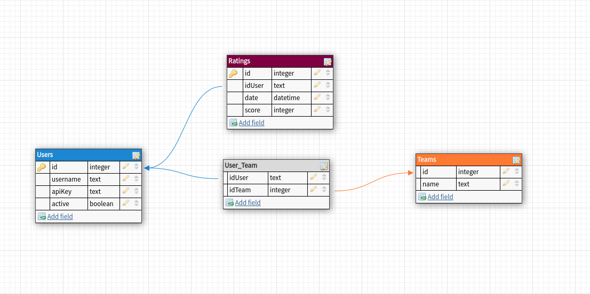

## Round Robin Prototype

(based on [Manual Técnico Round Robin](https://docs.google.com/document/d/1D2RVNj93oM8JMDRGGUH80TYrC7e4cE6a8qN3BHUOzww) by Paulo Colombo)

### Contenido

1. [Arquitectura](https://github.com/P2PModels/it-guide/blob/main/documentation/round_robin.md#arquitectura)
2. [Task Allocation Prototype](https://github.com/P2PModels/it-guide/blob/main/documentation/round_robin.md#task-allocation-prototype)
3. [Round Robin Connector](https://github.com/P2PModels/it-guide/blob/main/documentation/round_robin.md#round-robin-connector)
4. [Task Allocation Frontend](https://github.com/P2PModels/it-guide/blob/main/documentation/round_robin.md#task-allocation-frontend)
5. [Ether Manager](https://github.com/P2PModels/it-guide/blob/main/documentation/round_robin.md#ether-manager)
6. [Amara Proxy API](https://github.com/P2PModels/it-guide/blob/main/documentation/round_robin.md#amara-proxy-api)

### Arquitectura

Existen cinco componentes principales que la arquitectura del prototipo.

1. [Task Allocation Prototype](https://github.com/P2PModels/task-allocation-prototype): 
App implementada con Aragon, contiene el contrato Round Robin.
 
2. [Round Robin Connector](https://github.com/P2PModels/task-allocation-prototype/tree/develop/task-allocation/connector): 
Conector del prototipo implementado con Aragon Connect y The Graph. Se puede 
dividir en dos subcomponentes principales: 
    1. [Subgrafo](https://github.com/P2PModels/task-allocation-prototype/tree/develop/task-allocation/connector/subgraph): 
    subgrafo de The Graph de la aplicación 
    2. [Conector](https://github.com/P2PModels/task-allocation-prototype/tree/develop/task-allocation/connector): 
    es el conector en sí, implementado con el toolkit de Aragon Connect. Se encarga 
    de conectarse con el subgrafo y devolver los datos al cliente.

3. [Task Allocation Frontend](https://github.com/P2PModels/task-allocation-frontend): 
Frontend del prototipo implementado en React. Se conecta con el contrato Round 
Robin utilizando Aragon Connect. 

4. [Ether Manager](https://github.com/P2PModels/ether-manager): Es un worker o 
background task implementado con Node.js que se encarga de crear y enviar transacciones 
a Ethereum para reasignar las tareas a un nuevo lingüista una vez el marco de 
tiempo haya acabado.

5. [Amara Proxy API](https://github.com/P2PModels/amara-proxy-api): Es una api 
implementada con Node.js que actúa a modo de proxy para poder conectarnos a la 
API de Amara salteando las restricciones CORS. También contiene una base de datos 
SQLite que contiene las cuentas de los usuarios demo de nuestro prototipo. Estos 
son los que usarán los lingüistas para interactuar con nuestro prototipo en los 
workshops.


### Task Allocation Prototype

Aplicación Aragon del prototipo.

#### Estructura

- app/: Contiene el frontend de la aplicación. Ahora se encuentra en desuso 
debido a que se decidió usar Aragon Connect para desarrollar un frontend 
alternativo.
- connector/: Conector de la aplicación.
- contracts/
    - allocation-models/
        - RoundRobinApp.sol: Contrato del prototipo 
    - BaseTaskAllocation.sol: Contrato base del que deberían heredar todos los 
modelos. Contiene lógica común a todos ellos
- scripts/
    - buidler-hooks.js: Contiene funciones que se invocan en ciertos puntos del 
proceso de compilación y despliegue de la aplicación a nivel local. Si nuestra 
app requiere de cosas como ERC20 tokens, contratos de terceros u otras apps de 
Aragon, aquí es donde se definen y despliegan. Útil para preparar de antemano 
cualquier dependencia que nuestra app requiera
- test/: Tests de la app. Hasta el momento no se ha hecho ninguno.
- arapp.json: Fichero de configuración en el que definimos:
    - Los permisos de nuestra app. Se utilizan para restringir el acceso a las 
funciones de nuestro contrato
    - Los registros aragonPM de cada una de las redes en las que se va a publicar 
la app. Estos registros son los que se consultan cuando se quiere instalar 
nuestra app en una DAO
- buidler.config.js: Fichero de configuración del builder (ahora llamado hardhat). 
Podemos configurar cosas como: la red local donde queremos exponer la app, 
version del compilador de Solidity, puertos donde se expone el frontend o el 
cliente de Aragon, etc.
- package.json: Fichero de configuración NPM
- manifest.json: Fichero de configuración que contiene información básica de 
nuestra app. Básicamente, este fichero lo lee el cliente de Aragon para renderizar 
la siguiente vista en el apartado “App center”. A continuación podemos ver como 
se muestra el manifest de la app de Aragon Vault:


### Round Robin Connector

El conector Round Robin, es una pieza de software hecha con el toolkit [Aragon 
Connect](https://aragon.org/connect) que nos permite comunicarnos con los 
contratos del prototipo, ya sea para consultar datos o para invocar funciones 
del contrato. En el siguiente [artículo](https://p2pmodels.eu/amara-prototype-using-aragon-connect-and-the-graph/) 
se hace un repaso general del conector, explicando conceptos relativos al protocolo 
The Graph que utiliza y detallando las razones por las que se ha utilizado Aragon 
Connect y las ventajas y desventajas que ofrece.

### Subgrafo

Como se explica en el artículo, un subgrafo es una pieza de software que 
requieren los nodos de The Graph para saber qué contratos y qué eventos y funciones 
de estos deben escuchar. Los subgrafos también definen el esquema de la base de 
datos que especifica las entidades de datos a las cuales se deben mapear los 
datos procedentes de la blockchain, así como la manera en que este mapping se 
debe realizar.

Podemos dividir todo subgrafo en tres partes:
- El esquema GraphQL: La especificación de las entidades de datos a las que se 
deben mapear los datos procedentes de la blockchain. Se define utilizando el 
lenguaje de consulta GraphQL.
- Las funciones mappings: Las funciones que el subgrafo va a invocar cada vez 
que se detecte un nuevo evento del contrato. Reciben el evento del contrato y 
realizan los cambios pertinentes sobre la base de datos.
- El fichero subgraph.yaml: Este fichero contiene la especificación general del 
subgrafo. Aquí es donde se indican los contratos a seguir, los eventos de dichos 
contratos que se debe escuchar, las funciones mappings que deben invocarse cada 
vez que se detecte determinado evento, entre otras cosas. En el caso de los 
subgrafos de las aplicaciones de Aragon, estos son un poco más complejos que 
los subgrafos tradicionales, ya que no solo hay que escuchar los contratos de la 
app sino también los contratos del framework AragonOS de los que heredan toda 
app de Aragon. Por ello, Aragon Connect utiliza un fichero yaml distinto llamado 
`subgraph.template.yaml` que ya incorpora todos los contratos del framework 
AragonOS y a partir del cual se general el fichero subgraph.yaml que será el que 
utilice el nodo.

#### Estructura

- abis/: Este directorio contiene los abis tanto de los contratos por defecto 
que requiere un conector de Aragon como de los contratos que utiliza nuestra app 
de Aragon. 
- generated/: En este directorio se encuentran ficheros que se generan al 
desplegar al subgrafo.
- scripts/: Aquí se encuentran los scripts necesarios para desplegar el subgrafo 
- src/:
    - aragon/: Este directorio forma parte de todo conector de Aragon, viene por 
    defecto. Contiene los ficheros que definen los mappings para contratos de aragonOS
    - aragon-hooks.ts: Contiene una serie de hooks de Aragon que son invocados en 
    distintos puntos durante el proceso de creación de un template (data source 
    dinámico que todavía no ha sido desplegado). Desde que se detecta una nueva 
    instancia de una app de Aragon hasta que se crea el template
    - helpers.ts: Contiene funciones auxiliares para crear los ids de las entidades 
    GraphQL y getters para obtener dichas entidades
    - **RoundRobinApp.ts: Este es el fichero principal que define e implementa todos 
    los handlers de los eventos de la app**
    - task-statuses.ts:  Expone todos los posibles estados en los que puede se puede 
    encontrar una tarea.
- schema.graphql: Contiene el esquema GraphQL que define todas las entidades de 
    datos a las que serán mapeados los datos recibidos de la blockchain.
- subgraph.template.yaml: Este template utiliza [mustaches](https://www.npmjs.com/package/mustache) 
    para embeber los ficheros yaml que se encuentran en el directorio manifest/. 
    Algunos de los campos más importantes de este fichero son los siguientes:
    - description: Descripción breve del subgrafo. Esta descripción es la que se 
    muestra en la entrada que se crea en el explorador de subgrafos
    - repositorio: Enlace al repositorio donde se encuentra el subgrafo
    schema: 
    - file: Path donde se encuentra el esquema graphQl
    - dataSources: Los dataSources constituyen las entidades que el subgrafo va a 
    escuchar. Principalmente serán smart contracts.
    - templates: Los templates son dataSources dinámicos, es decir, dataSources que 
    todavía no han sido creados pero se hará en algún momento del tiempo. Aquí colocamos 
    el contrato de nuestra app de Aragon, ya que instancias de nuestra app se generan 
    de forma dinámica a medida que se instalan en las DAOs
        - kind: El tipo de template que vamos a escuchar. Generalmente será ethereum/contract
        name: Nombre de la entidad o contrato
        - network: Red en la que se encuentra desplegado
        - source:
            - abi: Nombre del fichero que contiene el abi del contrato.
            - mapping: Aquí definimos todos aquellos datos del contrato que queremos mapear
            - kind: El tipo del dato que queremos mapear. Generalmente querremos mapear 
            ethereum/events
            - entities: Aquí listamos todas las entidades GrahpQL a las que queremos 
            mapear los eventos.
            - abis: Aquí listamos el abi del contrato de nuestra app y todos aquellos 
            abis de los contratos que queremos utilizar dentro de los abis. Por ejemplo, si 
            nuestra app utiliza algún token u otra app de Aragon, debemos incluir los abis 
            aquí
            - eventHandlers: En este campo listamos todos los eventos que queremos 
            escuchar junto a su respectivo handler
            - event: Nombre del evento
            - handler: Nombre de la función que se va a encargar de mapear el evento
            - file: Path del fichero donde se encuentran definidos los handlers
- subgraph.yaml: Este es el fichero yaml que se genera al desplegar el subgrafo.
- manifest/: Este directorio forma parte de cualquier conector de Aragon. Posee 
ficheros yaml que contienen información de contratos importantes de aragonOS 
necesarios para que el subgrafo pueda escuchar cualquier DAO de Aragon y sus apps 
    - templates/: Ficheros yaml que contienen los templates (dataSources dinámicos) 
    de los contratos de aragonOS
    - data/: Este directorio contiene una serie de ficheros json (uno por cada red 
    blockchain) con datos que son embebidos en los ficheros yaml del directorio 
    templates. Este tipo de ficheros contienen los siguientes campos: 
    - network: La red en la que queremos que escuche el subgrafo
    - dataSourcers: Dentro de este campo definimos qué contratos escuchar.
    - Organizations: En este campo podemos especificar DAOs especificas que 
    queremos escuchar. Podemos encontrar esta dirección en la sección “Organization” 
    al abrir una DAO en el cliente de Aragon.
    - OrganizationFactories: Este campo contiene los contratos factoría de las DAOs. 
    Suele venir por defecto en todo conector de Aragon y es util ya que nos permite 
    escuchar los eventos relativos a la creación de nuevas DAOs y procesar los eventos 
    de esta, como es el caso del evento relacionado con la instalación de una nueva app, 
    provechoso para nosotros ya que así podemos detectar si se ha instalado nuestra app 
    de Aragon en una nueva DAO
    - OrganizationTemplates: Contiene un listado de contratos [template](https://hack.aragon.org/docs/templates-intro), que son 
    contratos que nos permite crear DAOs con un set de apps  y una configuración 
    predeterminada. Útil ya que nos permite escuchar aquellas DAO que hayan sido 
    creadas a través de un template y no, únicamente, a través del cliente.
    Podemos encontrar los templates hechos por Aragon [aquí](https://github.com/aragon/dao-templates)
        - TokenFactories: Contiene un listado de contratos que actúan como factorías 
        de token.
        - Tokens: Contiene un listado de tokens. Si nos interesa monitorear los eventos 
        de determinados tokens, aquí es donde debemos añadirlos.
        Por cada contrato que añadamos debemos proveer los siguientes campos:
        - name: Nombre del contrato
        - address: Dirección del contrato.
        - startBlock: Bloque en el que se desplegó el contrato. Especificando este 
        campo podemos optimizar el subgrafo especificando a partir de qué bloque tiene 
        que empezar a escuchar, obviando los anteriores. Para obtener el startBlock de 
        un contrato podemos consultar la transacción en la que se incluyó la creación 
        del contrato, para esto podemos utilizar exploradores de blockchain como 
        [etherscan](https://etherscan.io/) (para Ethereum) o [blockscout](https://blockscout.com/poa/xdai/) 
        (para xdai). Solo necesitamos introducir la dirección del contrato en la barra 
        de búsqueda y hacer clic en la transacción
Los ficheros de este directorio que terminan en “staging” están destinados a 
desarrollo y suelen contener solo unas cuantas DAOs específicas que escuchar, 
de manera que los despliegues del subgrafo sean mucho más rapidos. Por cada uno 
de estos ficheros debería haber un subgrafo publicado en el explorador de 
subgrafos de The Graph.

### Contector

El conector es el componente software que actúa como intermediario entre el 
cliente y el subgrafo, encargado de construir las queries GrahpQL y realizar 
las consultas a este.

#### Estructura

A continuación se describen algunos de los ficheros y directorios de mayor 
interés que conforman el proyecto: 

- models/: Este directorio contiene los modelos, estos son clases a las que se 
mapean las entidades GraphQL del esquema. A partir de estas, se instancian los 
objetos que serán devueltos al consumidor.
    - RoundRobin.ts: Este fichero contiene lo que se podría denominar un modelo del 
    conector, que expone métodos que nos permite consultar el esquema GraphQL y 
    consultar el contrato de nuestra app. Cada método de consulta se divide en dos 
    tipos de operaciones: uno que nos permite hacer una querie GraphQL en sí y otro 
    que nos permite crear suscripciones, una operación especial que funciona por 
    medio de websockets que nos permite mantener una conexión abierta entre el 
    consumidor y el conector de modo que cuando ocurre un cambio en el primero se 
    notifica al segundo. Es útil cuando queremos recibir actualizaciones frecuentes 
    en el frontend, por lo general es la operación que más utilizaremos. 
- test/: Contiene tests unitarios de cada modelo. Actualmente, no hay ninguno 
hecho para este prototipo.
- thegraph/: En este directorio se encuentra la implementación de The Graph del 
conector.
    - parsers/: Contiene parseadores encargados de mapear el objeto recibido al 
    hacer la consulta GraphQL a su correspondiente modelo
    - queries/: Contiene todas las queries GraphQL que el conector hacer al subgrafo. 
    Se utiliza graphql-tag para construir las queries
    - connector.ts: Contiene la implementación de The Graph del conector.
- connect.ts: Es el fichero principal del conector. Contiene la función principal 
encargada de crear el conector.

## Task Allocation Frontend

### Dependencias

- La librería de componentes [material-ui](https://material-ui.com/)
- La librería [web3.js](https://github.com/ethereum/web3.js/) para conectarnos 
a Ethereum.
- El mini framework [web3-react](https://github.com/NoahZinsmeister/web3-react) 
que nos abstrae de la lógica de gestión de los providers y wallets, así como el 
de exponer web3 a todos nuestros componentes.
- Utilizamos [react-router](https://reactrouter.com/) para gestionar el enrutamiento
- Las librerías de Aragon Connect y el [conector](https://www.npmjs.com/package/@p2pmodels/connect-round-robin) 
de nuestro prototipo 
- El cliente HTTP [axios](https://github.com/axios/axios) para poder conectarnos 
a la API de Amara.
- Se utiliza [react-blockies](https://github.com/ethereum/blockies) para generar 
los identicons de las cuentas de Ethereum

### Variables de entorno

```
REACT_APP_AMARA_STAGING_API="https://amara-api-proxy.herokuapp.com/"
REACT_APP_TASK_ALLOCATION_APP_NAME="ta-round-robin"
REACT_APP_TASK_ALLOCATION_INSTANCE="staging"
REACT_APP_SERVER_ACCOUNT_PRIVATE_KEY="ce8e3bda3b44269c147747a373646393b1504bfcbb73fc9564f5d753d8116608"
```

### Estructura

- amara-api/: Expone un objeto con las funciones necesarias para hacer 
peticiones a la Proxy API. Habría que convertirlo en un hook. 
- assets/: Contiene las fuentes e imágenes.
- components/: Componentes de la aplicación
- contexts/
    - Connect.js: Contexto que abstrae de algunos detalles del contexto Connect que 
    ofrece Aragon Connect
    - AppState.js: Expone el estado general de la app. Utiliza useOrgData por debajo
- helpers/: Contiene ficheros con funciones auxiliares que se utilizan a lo largo del proyecto.
- hooks/
    - useActions.js: Este hook expone todas las funciones del contrato que podemos 
    invocar a través del conector
    - useAnimationFrame.js: Este hook se utiliza para implementar animaciones. Se 
    utiliza específicamente para crear la animación del timer de las tareas 
    - useEagerConnect.js: Se utiliza para conectarnos automáticamente a la wallet 
    si en ocasiones pasadas ya le hemos dado permiso
    - useInactiveListener.js: Se utiliza para suscribirnos a eventos de las wallets 
    y conectarnos automáticamente a esta cuando alguno de estos ocurra
    - useOrgData.js: Expone información relativa de la organización: apps instaladas, 
    permisos, dirección de la dao, inicializa el conector, etc.
    - useSubscriptions.js: Expone las suscripciones del conector
    - useUserLogic.js: Crear y expone el estado del usuario demo: usuario de Amara, 
tareas disponibles o aceptadas, etc.
- pages/: Componentes vista
- App.js: Componente principal
- Routes.js: Este componente define todas las rutas de nuestra aplicación
- actions-types.js: Definimos cada una de las acciones que podamos realizar con el contrato
- language-codes.js: Mapa codigo -> lenguaje para procesar los datos de las tareas que nos llega de la API de Amara.
- mock-data.js: Datos de prueba para desarrollo en local.
- networks.js: Fichero de configuración de las redes de Ethereum que utiliza la 
app. Contiene información como por ejemplo: address del contrato Round Robin, 
id de las redes, tipo de conector de Aragon Connect, etc.
- theme.js: Define el estilo general de la app. Fuentes, colores, etc
- types.js: Define los estados de las tareas
- wallet-providers.js: Define los proveedores de las wallets que soporta la app. 
Actualmente solo soporta Metamask.

## Ether Manager

Como se ha mencionado anteriormente, este componente define un worker hecho con 
Node.js encargado de crear las transacciones para reasignar las tareas del 
prototipo evitando que los usuarios tengan que costear las transacciones. 

El worker posee una cuenta de Ethereum con las que firma las transacciones. 
Escucha los eventos emitidos por el contrato a la espera de que un evento del 
tipo *TaskAllocated* sea recibido. Cuando esto ocurre se crea un cron job que 
contiene la lógica necesaria para crear, firmar y ejecutar las transacciones de 
reasignación. Los cronjobs se ejecutan cuando acaba el periodo cuando acaba el 
tiempo de la tarea.

### Dependencias

- [cron](https://github.com/kelektiv/node-cron): Un paquete que nos permite 
crear jobs en Node.js
- [winston](https://github.com/winstonjs/winston): Logger para Node.js
- [web3](https://github.com/ethereum/web3.js/): Librería que nos permite 
comunicarnos con Ethereum

### Variables de entorno

```
RINKEBY_SERVER_ACCOUNT_ADDRESS=0x8401Eb5ff34cc943f096A32EF3d5113FEbE8D4Eb
RINKEBY_SERVER_ACCOUNT_PRIVATE_KEY=ce8e3bda3b44269c147747a373646393b1504bfcbb73fc9564f5d753d8116608
RINKEBY_PROVIDER=wss://rinkeby.infura.io/ws/v3/88f3606bf02b4efca953de22711a0caf
INFURA_PROJECT_ID=88f3606bf02b4efca953de22711a0caf
```

### Estructura

- abis/: Este directorio contiene el abi del contrato . Necesario crear una 
instancia del mismo que pueda ser utilizada en el proyecto. Hay que actualizar 
con el abi de la nueva versión del contrato cada vez que se modifique este
- ethereum/
    - task-allocation-models/
        - round-robin/
            - event-listener-helpers.js: Expone funciones auxiliares como las encargadas 
            de crear los cron jobs o handlers para cada uno de los eventos que escucha el 
            worker
            - mock-data-helpers.js: Expone funciones auxiliares encargadas de generar 
            mock data
            - mock-data.js: De aquí lee los datos el comando que genera mock data
            - round-robin.js: Configura y expone una instancia del contrato 
    - web3-utils.js: Expone funciones auxiliares de web3
    - web3.js: Fichero que configura y expone la instancia de web3.js
- scripts
    - create-mock-data.js: Fichero que se ejecuta al invocar los comandos que generan 
    mock data
    - start-event-listeners.js: Es el fichero que se ejecuta al invocar el comando 
    start
- config.js: Fichero de configuración que lee las variables de entorno y las expone
- Procfile: Fichero de Heroku, necesario para hostear el worker en la plataforma.
- testingContract.js: Funciones que invocan metodos del contrato y nos permite depurar
- winston.js: Fichero de configuración del logger winston

## Amara Proxy API

### Dependencias

- [axios](https://github.com/axios/axios): Cliente HTTP para Node.js
- [sqlite3](https://github.com/mapbox/node-sqlite3): Cliente SQLite para Node.js

### Variables de entorno

```
#Amara APIs
AMARA_API=https://amara.org/api/
AMARA_STAGING_API=https://staging.amara.org/api/
AMARA_STAGING_API_KEY=525a2b625baf11a48566f4b32876d0bfad9375ba
#Proxy Amara API port
PORT=5000
```

### Estructura

- middlewares
- models: Contiene la base de datos de los usuarios y los scripts necesarios 
para generarla y crear mock data
    - schemes
        - amara-users.db
    - scripts
        - amara-users.db.sql
        - mock-data.sql
- routes: En este directorio se encuentran todas las rutas de la API. La gran 
mayoría se encarga esencialmente de redirigir las peticiones a la API de Amara, 
exceptuando los directorios rating y users 
    - rating/: Rutas relacionadas con operaciones de feedback efectuadas contra la 
    base de datos SQLite
    - teams/: Rutas relacionadas con operaciones para obtener información sobre 
    los equipos y  las tareas de traducción y subtitulado disponibles.
    - users/: Aquí se encuentra todas las rutas que efectúan operaciones de usuarios 
    contra la base de datos SQLite
    - videos/Rutas relacionadas con operaciones para obtener los videos que se 
    deben traducir.
    - createRouter.js
- utils
    - amara-utils.js
- app.js
- axios.js
- config.js
- createExpressApp.js
- Procfile
- winston.js: Fichero de configuración del logger.

### Esquema de Base de Datos

Algunos campos de las tablas que cabe mencionar son:

- Users
    - active: Booleano que se establece a uno cuando alguien ha entrado en el 
    prototipo con ese usuario determinado
- Ratings
    - El score se califica de 1 a 5.

La tabla team es necesaria ya que no es posible obtener los equipos de proyecto 
a los que pertenece un usuario a partir de este, sino únicamente consultando 
cada equipo existente en la plataforma y comprobar que el usuario es miembro. 
Es más eficiente llevar un registro de este en la base de datos



### Referencias

- Api de Amara: https://apidocs.amara.org/#api-overview
- Página de Amara: https://amara.org/en/ 
