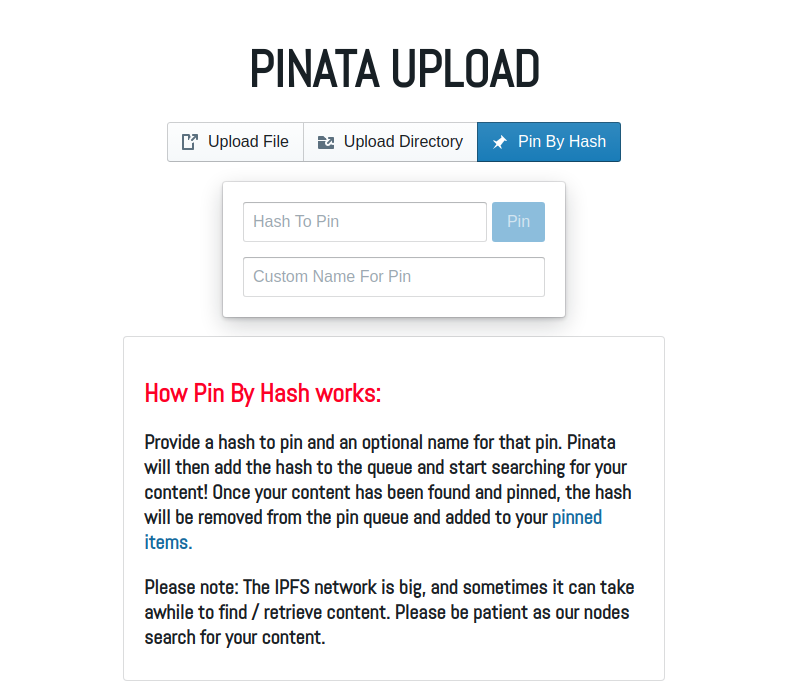
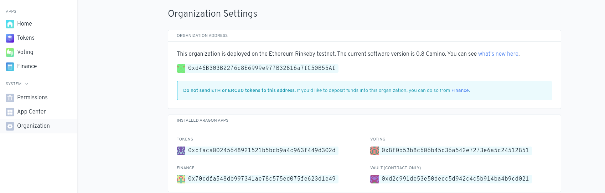
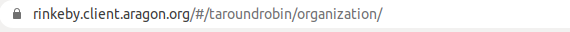
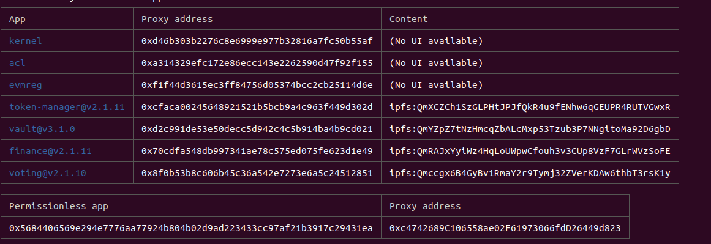

# Tutorials and guidelines about working with Aragon

## Contenido

1. [Desplegar Aragon app a red de Ethereum](https://github.com/P2PModels/it-guide/blob/main/guidelines/aragon.md#desplegar-aragon-app-a-red-de-ethereum)
2. [Crear una DAO con el CLI](https://github.com/P2PModels/it-guide/blob/main/guidelines/aragon.md#crear-una-dao-con-el-cli)
3. [Instalar app en una DAO de Aragon](https://github.com/P2PModels/it-guide/blob/main/guidelines/aragon.md#instalar-app-en-una-dao-de-aragon)
4. [Actualizar la app de una DAO](https://github.com/P2PModels/it-guide/blob/main/guidelines/aragon.md#actualizar-la-app-de-una-dao)
5. [Obtener el app id de una aplicación de Aragon](https://github.com/P2PModels/it-guide/blob/main/guidelines/aragon.md#obtener-el-app-id-de-una-aplicaci%C3%B3n-de-aragon)

## Desplegar Aragon app a red de Ethereum

(basado en [Guides Publish](https://hack.aragon.org/docs/guides-publish))

1. Clonar proyecto, e.g., `git clone https://github.com/P2PModels/task-allocation-prototype.git`
2. Ingresar a directorio de proyecto, e.g., `cd task-allocation-prototype`
3. Instalar dependencias del proyecto `npm i`
4. Desde otra terminal, iniciar el daemon de IPFS `ipfs daemon`
5. Desde el directorio de la aplicación ejectura `npx buidler publish <bump> --network <network>`
donde `<bump>` puede ser `major`, `minor` o `patch` y las opciones de `<network>` 
`rinkeby`, `mainnet` o `local`
6. Para asegurarnos que el frontend se mantenga siempre accesible en IPFS debemos 
utilizar un servicio de pinning, como por ejemplo `Pinata`, que es básicamente un 
servicio que publica nuestro contenido en un nodo de IPFS y lo mantiene “vivo” 
para que siempre esté accesible. 
    1. Iniciamos sesión con el usuario de p2pmodels y nos dirigimos a “Pinata Upload” 
    donde seleccionamos “Pin By Hash”, aquí introduciremos un nombre para el 
    contenido (podemos poner la versión de la aplicación que hemos subido a 
    aragonPM) que queremos pinnear y el hash de IPFS, que lo podemos obtener 
    del resultado del paso previo



En caso de que el comando se haya ejecutado perfectamente, este publicará una 
nueva versión de los contratos en el repo de aragonPM y subirá el código del 
frontend a IPFS. Una vez haya terminado la operación nos devolverá algo parecido 
a lo siguiente:

```
main     |   Publish new version 1.0.0 (major)
main     | 
main     |   Contract address:  0xb58ffAC78036afF2659243F7260BDf9dfd18b0dc
main     |   ContentURI:        QmeNbaTHLLoGdcDppG7xf7PvK3Tm61LqMKLkG2kdKo2NRh
main     | 
main     |   http://localhost:8080/ipfs/QmeNbaTHLLoGdcDppG7xf7PvK3Tm61LqMKLkG2kdKo2NRh
main     | 
main     | 
main     |   Tx sent
main     | 
main     |   Tx hash:  0x16e7967568727a4189fb02ab38f208f2f844fc285d42860b9a835fc9c40849f6
main     |   
main     |   https://rinkeby.etherscan.io/tx/0x16e7967568727a4189fb02ab38f208f2f844fc285d42860b9a835fc9c40849f6
main     |   
main     | 
main     |   Tx mined
main     |   
main     |   Status:        Success
main     |   Block number:  7534006
main     |   Gas used:      242391
```

Una vez hayamos desplegado la app, podemos instalarla en una nueva DAO o 
actualizar aquella ya instalada. Todos los comandos utilizados en los siguientes 
dos apartados los podemos encontrar [aqui](https://hack.aragon.org/docs/cli-dao-commands)

### Troubleshooting

Si al ejecutar el comando 5 (builder) nos devuelve el siguiente error:

```
Error in plugin @a’ragon/buidler-aragon: Account <account> does not have 
permissions to publish a new version in repo ta-round-robin.open.aragonpm.eth
```

donde `<account>` se refiere a la cuenta definida en el json rinkeby_key que se 
encuentra dentro del directorio `~/.aragon` que es la cuenta que utiliza el CLI 
de Aragon para ejecutar las transacciones que hagan sus comandos.

Debemos establecer la cuenta con permisos para acceder al aragonPM definida 
en la [credenciales](https://github.com/P2PModels/it-guide/blob/main/credentials/amara.md) 
de Amara como la cuenta que el `aragonCLI` utilizará para interactuar con la 
blockchain. Para ello podemos seguir las instrucciones definidas 
[aqui](https://hack.aragon.org/docs/guides-faq#set-a-private-key).

## Crear una DAO con el CLI

Podemos utilizar el siguiente [comando](https://hack.aragon.org/docs/cli-dao-commands#dao-new) 
para crear una DAO con el CLI que no tenga apps por defecto instaladas 
(voting, tokenManager, finance, etc).

## Instalar app en una DAO de Aragon

(basado en [CLI DAO Commands](https://hack.aragon.org/docs/cli-dao-commands))

Al utilizar la interfaz grafica de Aragon para crear una DAO, se creará una 
app Voting y TokenManager por defecto y se configuraran los permisos de forma 
que las instalaciones de nuevas apps o el establecimiento de nuevos permisos 
deban hacerse al pasar una votación.  Por lo tanto al hacer algo de este estilo 
se creará una votación en la que debemos votar “Yes”.

Si no tenemos creada una DAO de Aragon, podemos hacerlo utilizando el cliente 
a través del siguiente [enlace](https://rinkeby.client.aragon.org/#/).

Podemos instalar una app en una DAO existente podemos utilizar el siguiente 
comando del CLI de Aragon

`dao install <dao-addr or dao-ens> <app-apm-repo>`

donde `<app-apm-repo>` es el repositorio `aragonPM` donde se encuentra la
aplicación. Podemos encontrarlo en el fichero `arapp.json` que se encuentra en 
la raíz del proyecto. En el caso del prototipo Round Robin sería: 
`ta-round-robin.open.aragonpm.eth`

Una vez hayamos ejecutado el comando y si hemos creado nuestra DAO utilizando 
la interfaz grafica de Aragon, se abrirá una votación en Voting que debemos 
aprobar para que se instale la app.

La dirección de la DAO la podemos obtener en el apartado organization de la DAO 
expuesta a través del cliente de Aragon.



El ens de la DAO lo podemos obtener directamente de la url de la DAO. En el 
caso de la DAO donde tenemos instalado el prototipo Round Robin, el ens sería 
`taroundrobin`



Una vez hayamos ejecutado el comando , votamos en la votación que se acaba de 
crear. Para que la app se vea en el panel lateral del cliente junto al resto de 
aplicaciones debemos crear al menos uno de los permisos que le hemos definido.

Para crear un nuevo permiso utilizamos el siguiente comando:

`dao acl create <dao-addr> <app-proxy-addr> <role> <entity> <manager>`

donde `<role>` es el id del permiso que queremos crear. Lo podemos encontrar en 
el fichero `arapp.json`, por ejemplo: `ALLOCATE_TASK_ROLE`. El parámetro `<entity>` 
es el address de la entidad a la queremos conceder el permiso (puede ser una 
address de cuenta o de un contrato). Si queremos que todo el mundo tenga el 
permiso `ANY_ACCOUNT` podemos utilizar la siguiente address predefinida por Aragon
`0xffffffffffffffffffffffffffffffffffffffff`. El parámetro `<manager>` es el 
address de la entidad que puede conceder o revocar este permiso. Generalmente, 
ponemos aquí la address del Voting. El parámetro `<app-proxy-addr>` corresponder con 
el address del contrato proxy de la app. Lo podemos encontrar ejecutando el 
siguiente comando que nos devuelve un listado con todas las apps instaladas en una DAO
`dao apps <dao-ens or dao-address> --all  --environment aragon:<network>` lo que
devolverá algo parecido a lo siguiente



Nuestra app sería la que se muestra en `Permissionless app`

Una vez hayamos ejecutado el comando y si hemos creado nuestra DAO utilizando 
la interfaz grafica de Aragon, se abrirá una votación en Voting que debemos 
aprobar para que se cree el permiso.

## Actualizar la app de una DAO

(basado en [DAO Upgrade](https://hack.aragon.org/docs/cli-dao-commands#dao-upgrade)) 

`dao upgrade <dao-addr> <app-apm-repo>`

## Obtener el app id de una aplicación de Aragon

El app id de una aplicación es util para saber cuando debemos instanciar una 
nueva template en el hook `getTemplateApp` del fichero `aragon-hooks.ts`. Este 
no es mas que el valor hexadecimal encriptado del nombre del repositorio de la 
app en `aragonPM` y lo podemos obtener utilizando el siguiente contrato en Remix

```solidity
pragma solidity >=0.7.0 <0.8.0;

contract Namehash {

    bytes32 internal constant APM_NODE = 0x9065c3e7f7b7ef1ef4e53d2d0b8e0cef02874ab020c1ece79d5f0d3d0111c0ba;
    
    function apmNamehash(string memory appName) internal pure returns (bytes32) {
        return keccak256(abi.encodePacked(APM_NODE, keccak256(bytes(appName))));
    } 
    
    function getOpenApmNamehash(string memory appName) public pure returns (bytes32) {
        return keccak256(abi.encodePacked(apmNamehash("open"), keccak256(bytes(appName))));
    }

}
```

Llamamos a la función `getOpenApmNamehash` al cual le pasamos el nombre de la 
app, que podemos encontrar en el fichero `arapp.json` de la app de Aragon. El 
nombre sería la cadena de texto hasta el `“.open”`, asi por ejemplo para la app 
Round Robin el ens del repo sería `ta-round-robin.open.aragonpm.eth`, por lo 
que el nombre de la app es: `ta-round-robin`
