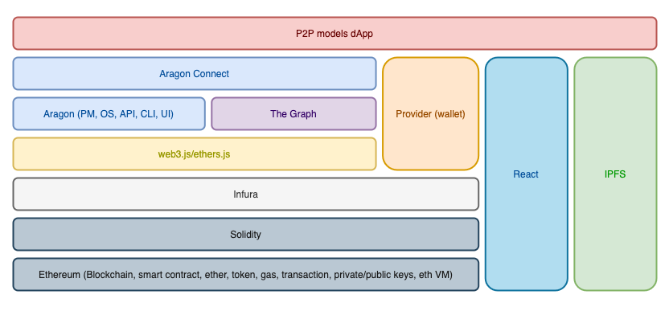

# Technology Stack of P2P models

In P2P models, we based our technical developments on the following stack of technologies. 
The basis of the stack is [Ethereum](https://ethereum.org/en) and the programming language 
[Solidity](https://docs.soliditylang.org/en/v0.8.5), which is used to implement the business logic of the solutions.
[Infura](https://infura.io) is employed to connect to Ethereum and the javascript libraries [Web3](https://web3js.readthedocs.io/en/v1.3.4) 
or [Ethers](https://docs.ethers.io/v5/single-page) to communicate with the blockchain. We leverage on 
[The Graph](https://thegraph.com) to ease the access to data stored in the blockchain. [Aragon](https://aragon.org/) is used as the 
framework to implement decentralized autonomous organizations (DAOs) while [React](https://reactjs.org) 
(and [Material UI](https://material-ui.com/)) provides the tools to build the user interface. Aragon uses 
InterPlanetary File System ([IPFS](https://ipfs.io/)) to deploy decentralized applications to Ethereum. We use
[MetaMask](https://metamask.io) as the gateway to the Ethereum-based applications.

