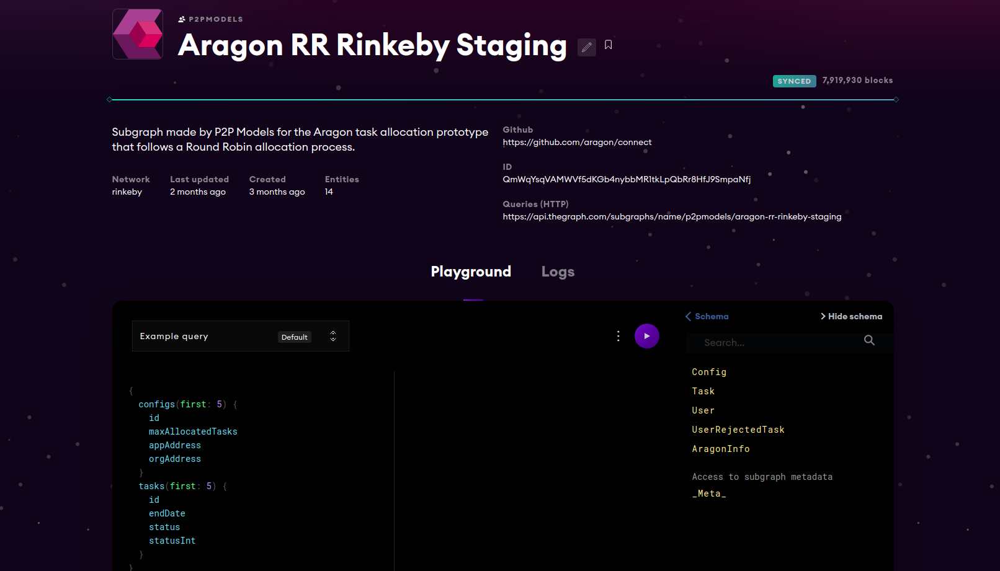
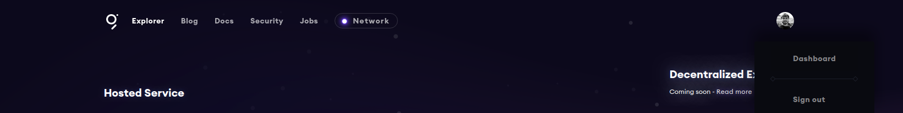
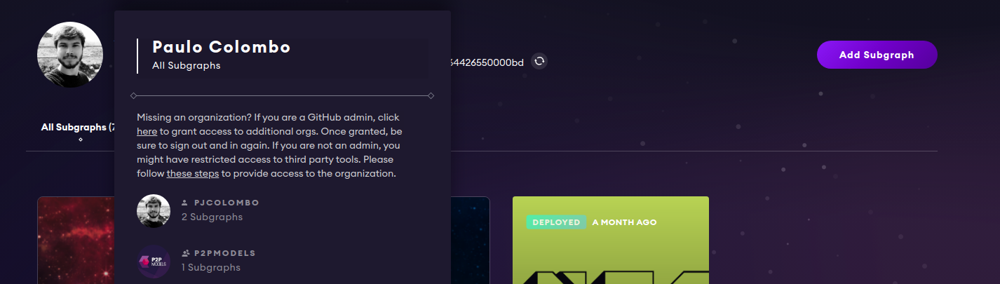
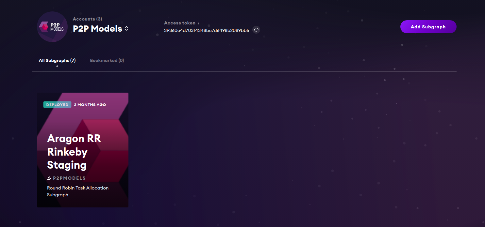
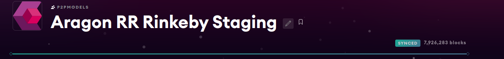

# Tutorials and guidelines about working with The Graph

## Contenido

1. [Explorador de Subgrafos de The Graph](https://github.com/P2PModels/it-guide/blob/main/guidelines/thegraph.md#explorador-de-subgrafos-de-the-graph)
2. [Desplegar un subgrafo](https://github.com/P2PModels/it-guide/blob/main/guidelines/thegraph.md#explorador-de-subgrafos-de-the-graph)

## Explorador de Subgrafos de The Graph

El explorador de subgrafos es un portal web que nos permite visualizar todos 
los subgrafos desplegados en los nodos del protocolo; interactuar con ellos a 
través de un panel que nos permite realizar queries a los subgrafos; y consultar 
los logs de actividad de este. Cuando se despliega un subgrafo en el protocolo 
se crea una nueva entrada en el explorador.

Esta sería la entrada para el subgrafo del Round Robin:

## Desplegar un subgrafo

El despliegue de un subgrafo se debe hacer utilizando una cuenta de Github, 
específicamente, utilizando un token de acceso asociado a dicha cuenta.

Para obtener dicho token debemos hacer lo siguiente: 

1. Dirigirse a la [página de The Graph](https://thegraph.com) e iniciar
sesión con una cuenta de Github, la cual debe estar asociada a la 
organización de P2P Models
2. Dirigiarse al dashboard
3. Clic sobre el nombre de usuario de Github, una lista desplegable aparecerá. 
Como se puede observar, todo subgrafo desplegado está asociado a un perfil de 
Github, ya sea nuestra cuenta personal o el de una organización.
4. Seleccionamos P2P Model. Esto nos redirigirá al perfil de la organización 
donde se encuentra un listado de todos los subgrafos asociados a esta y el 
token de acceso/GRAPHKEY (el cual podemos regenerar siempre que queramos)

Una vez se tenga el token seguir los siguientes pasos:

1. Abrir una terminal y dirigirse al directorio donde se encuentra el subgrafo;
2. Inicializar la variable de entorno GRAPHKEY con el token que hemos copiado 
del portal web, esto es ejecutar `export GRAPHKEY=<access token>`;
3. Ejecutar alguno de los comandos definidos en el `package.json` del proyecto 
teniendo en cuenta la red en la que se quiere desplegar el subgrafo. Así, por 
ejemplo, si se quiere desplegar el subgrafo en rinkeby se ejecutar `npm run deploy-rinkeby`;
4. Esperar a que el subgrafo se despliegue y luego dirigirse a la entrada del 
subgrafo en el explorador y esperar a que termine de sincronizarse.

Referencias

- [Como crear un subgrafo para una app de Aragon](https://connect.aragon.org/advanced/app-subgraphs)
- [Documentación general de The Graph](https://thegraph.com/docs/introduction)
- [Información acerca de los subgrafos](https://thegraph.com/docs/define-a-subgraph#the-subgraph-manifest)
- [API de AssemblyScript](https://thegraph.com/docs/assemblyscript-api#api-reference)