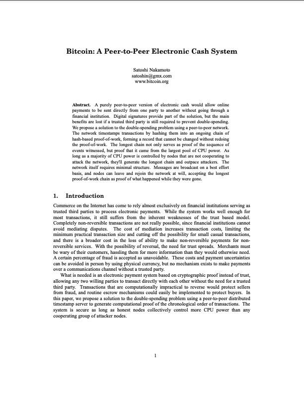
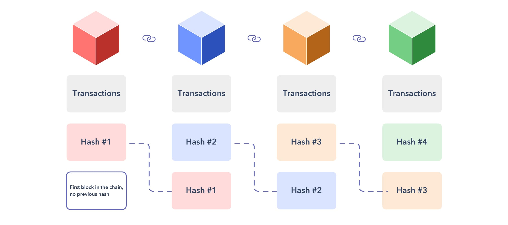
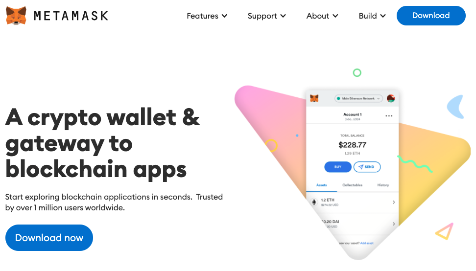

# Blockchain, Ethereum, Smart contracts, Solidity

## Blockchain

El 31 de Octubre de 2008, coincidiendo con la crisis económica de aquel año, se 
publica un artículo titulado ["Bitcoin: A Peer-to-peer Electronic Cash System"](https://bitcoin.org/bitcoin.pdf) 
en el cual el autor, que se hace llamar Satoshi Nakamoto, describe un sistema que
permite a las personas intercambiar entre si, esto es peer-to-peer (P2P), una moneda 
electrónica sin necesidad de una autoridad intermediaria central o banco.



Una de las ideas centrales del sistema P2P de Bitcoin fue la de usar una cadena 
de bloques (o blockchain) para almacenar las operaciones monetarias que realizaron
las partes que componen el sistema. Inicialmente, entonces, blockchain fue concebido 
como la herramienta que posibilitó el funcionamiento de la red Bitcoin almacenando
las operaciones que ocurrian dentro de ella.



## Ethereum

Con el paso del tiempo los entusiastas de Bitcoin se dieron cuenta que las innovaciones
tecnológicas propuestas por Satoshi podrían servir no solo para soportar la operación
de una red de transferacias financieras sino que también para soportar el funcionamiento
de aplicaciones mucho más complejas.

Una de estas personas fue [Vitalik Buterin](https://en.wikipedia.org/wiki/Vitalik_Buterin)
quién en 2013 presentó a través un artículo unas ideas de una blockchain de propósito 
general y programable a través de la cual desarrolladores podrían construir aplicaciones 
decentralizadas abstrayéndolos de los detalles implementativos de la red P2P, la blockchain, 
y los algoritmos de consenso.

Vitalik junto a [Gavin Wood](https://en.wikipedia.org/wiki/Gavin_Wood) fueron puliendo 
por años estas ideas incipientes hasta que en Julio de 2015 se crea (mina) el primer 
bloque de la blockchain de Ethereum dando inicio a su operación.

### Principales componentes

- **Red P2P**: Ethereum se ejecuta en la red principal de Ethereum (Mainnet) siguiendo
el protocolo *DEVp2p*. Además de la mainnet, existen redes Ethereum alternativas 
como  Rinkeby o Ropsten;
- **Reglas de consenso**: definidas en el [Yellow Paper](https://ethereum.github.io/yellowpaper/paper.pdf)
de Ethereum;
- **Transacciones**: son mensajes de red que incluyen, entre otras cosas, remitente, 
destinatario, valor, datos;
- **Máquina de estados**: las transiciones de estado en Etherum son procesadas por la
máquina virtual de Ethereum ([EVM](https://ethereum.org/en/developers/docs/evm/)). 
Los programas de la EVM se llama smart contracts que son escritos en lenguajes de 
alto nivel, como Solidity, y compilados a lenguaje máquina (bytecode);
- **Estructuras de datos**: el estado de la red Ethereum se almacena en base de datos 
alojadas en nodos de la red (ej., [LevelDB](https://en.wikipedia.org/wiki/LevelDB]))
que contienen la información de las transacciones en un formato serializado llamado
[Merkle Patricipa Trie](https://easythereentropy.wordpress.com/2014/06/04/understanding-the-ethereum-trie/);
- **Algoritmos de consenso**: desde sus inicios Ethereum utilizó el algoritmo de 
consenso y verificación de transacciones [Proof-of-Work (PoW)](https://ethereum.org/en/developers/docs/consensus-mechanisms/pow/) 
propuesto por Bitcoin. En la actualidad existe en curso un proceso de migración 
a un nuevo y más eficiente algoritmo de consenso llamado 
[Proof-of-Stake (PoS)](https://ethereum.org/en/developers/docs/consensus-mechanisms/pos/);
- **Clientes**: aplicaciones de software que implementan las especificaciones de
Ethereum y permite la comunicación a través de la red P2P con otros clientes de
Ethereum.

### Ethers y Wallets

La moneda en Ethereum es el *ether*. Para interactuar con la red ethereum se necesita
una cuenta con ethers. Estos ethers se almacenan en Wallets, que no son otra cosa 
que aplicaciones de software que ayudan a gestionar una cuenta.

Existen gran variedad de wallets, de todo tipo, web-based, desktop, móvil, e
incluso dispositivos físicos llamados cold wallets. [Metamask](https://metamask.io) 
es una wallet muy utilizada por su facilidad de uso y conveniencia, especialmente 
en entornos de prueba. [Aquí](https://github.com/ethereumbook/ethereumbook/blob/develop/02intro.asciidoc#getting-started-with-metamask) 
se explica como crear un wallet en Metamask y agregar ethers de prueba.



### Smart contracts y Solidity

Los programas de computador que se ejecutan sobre la red Ethereum en el contexto 
de la EVM se llaman *smart contracts*. Los smart contracts son escritos en lenguajes 
de alto nivel y luego compilados en código máquina. Uno de estos lenguajes,
quizás el más extendido de ellos, es [Solidity](https://docs.soliditylang.org/en/latest/) 
creado por Gavin Wood, uno de los co-creadores de Ethereum. Otra opción de lenguaje
para contratos inteligentes es [Vyper](https://vyper.readthedocs.io/en/stable/).

Solidity es un lenguaje de programación imperativo de [código abierto](https://github.com/ethereum/solidity) 
con una sintáxis parecida al lenguaje Java. A continuación se puede apreciar un ejemplo
extraído de la documentación de Ethereum.

```Solidity
// SPDX-License-Identifier: GPL-3.0
pragma solidity >= 0.7.0;

contract Coin {
    // The keyword "public" makes variables
    // accessible from other contracts
    address public minter;
    mapping (address => uint) public balances;

    // Events allow clients to react to specific
    // contract changes you declare
    event Sent(address from, address to, uint amount);

    // Constructor code is only run when the contract
    // is created
    constructor() {
        minter = msg.sender;
    }

    // Sends an amount of newly created coins to an address
    // Can only be called by the contract creator
    function mint(address receiver, uint amount) public {
        require(msg.sender == minter);
        require(amount < 1e60);
        balances[receiver] += amount;
    }

    // Sends an amount of existing coins
    // from any caller to an address
    function send(address receiver, uint amount) public {
        require(amount <= balances[msg.sender], "Insufficient balance.");
        balances[msg.sender] -= amount;
        balances[receiver] += amount;
        emit Sent(msg.sender, receiver, amount);
    }
}
```

Para más información sobre Solidity consultar los tutoriales y documentación en 
el directorio [materials](../materials) de este repositorio.

## Referencias

- [Ethereum Development Documentation](https://ethereum.org/en/developers/docs/)

- [Mastering Ethererum: Building smart contracts and dapps](https://github.com/ethereumbook/ethereumbook)

- [Ethereum and Solidity: The complete developer guide](https://www.udemy.com/course/ethereum-and-solidity-the-complete-developers-guide)

