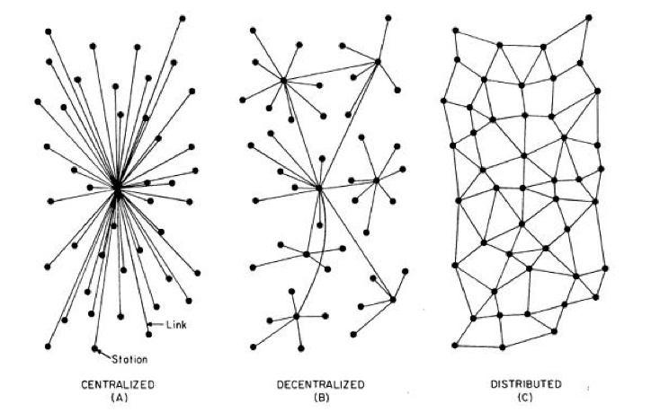

# Decentralized Applications (dapps)

A dapp is an application that works primarily or entirely in a decentralized 
fashion. The main advantages of a dapp over centralized solutions are i) 
`resilience` because the application business logic can be distributed throughout 
the P2P network; ii) `transparency` because you can access the source code of the 
application hosted on the blockchain (as long as it is public like the Ethereum 
mainnet); iii) and `censorship resistance` since the distributed nature of the 
network on which it operates allows any user to interact with the dapp without 
interference from a central authority.

## Backend

The backend of the dapps is the smart contracts responsible for storing all the 
application's business logic. An aspect to consider in developing smart contracts 
is the impossibility of changing the code once it has been deployed on the blockchain.

Exist frameworks that facilitate the deployment and testing of smart contracts. 
Truffle and the more recent Hardhat are two examples of them. The directory [materials] (../ materials / technical_refs.md) 
from this repository contains technical references to Truffle' and Hardhat's documentation.

## Frontend

The dapps frontend can be implemented using standard web technology
(HTML, CSS, Javascript) unlike the backend that is developed using smart contracts.

### Web3

Usually, the frontend of a dapp interacts with Ethereum through a javascript 
library called [Web3] (https://web3js.readthedocs.io/en/v1.5.2/). Web3 is responsible 
for managing the access to local or remote Ethereum nodes and dealing with the 
interaction with the wallets.

For more information on Web3 consult the technical documentation at [materials] (../ materials / technical_refs.md) 
from this repository.

### React

[React] (https://reactjs.org) is currently one of the most widely used frameworks 
for developing web interfaces. Created by Facebook, React offers a set of tools 
that facilitates the management of the UI components and the status of the application.

The directory [bibliography / books] (../ bibliography / books / README.md) of 
this repository has a link to the book `Learning React`, which can serve as a 
reference for learning how to program in React.
