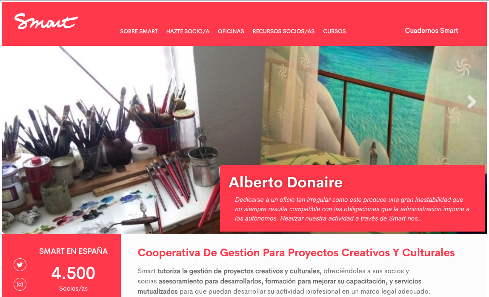

# Smart

[SMART](https://www.smart-ib.coop) is a cooperative that gathers self-employed 
workers primarily from the artistic sector. It assists its members throughout the 
process of creating and managing their creative and cultural projects. In Spain, 
it has 4.500 members who are primarily from Spain and distributed in Madrid, 
Barcelona, and Seville, cites where the cooperative has headquarters.

A very noticeable temporality characterizes the working conditions of Smart members. 
Half of the registered contracts are one day long. This situation has significant 
implications in terms of instability, security, and payment.

## P2P Model

Smart is one of the case studies of the research project P2P Models. For the last 
three years, researchers of the P2P Model project have been working with servants 
and members of SMART cooperative to design and develop blockchain-based technologies 
that help them improve the operation of the organization and the working conditions 
of the artists.

In line with these efforts, this project aims at raising social awareness about 
the precarious working conditions of the artist sector in Spain by collecting 
and visualizing complaints of payment delays and no payments. The idea is to 
combine two modern technologies, such as social networks and blockchain, to 
build an uncensored decentralized tool to visualize social media complaints.