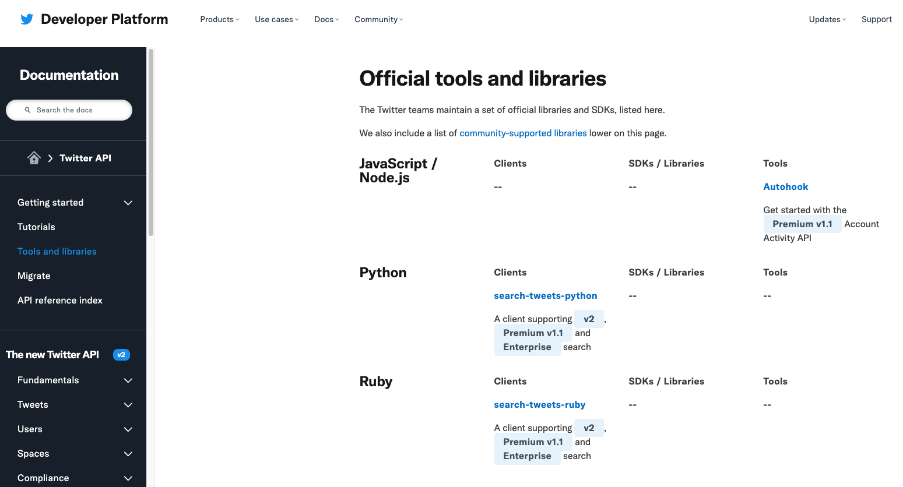

# Twitter API

Twitter ofrece a los desarrolladores una serie de APIs RESTful que permiten
interactuar con la plataforma. A través de las APIs se puede crear contenido así
como también extraer datos.

Lo primero para utilizar cualquier API es leer detenidamente la [documentación](https://developer.twitter.com/en/docs/twitter-api)
lo que permitirá conocer los funcionalidades disponibles para el desarrollador.
Luego, es recomendable contar con un cliente RESTful, por ejemplo [Postman](https://www.postman.com/product/api-client/), 
para hacer peticiones de prueba y visualizar las respuestas. Una vez se tenga
el lenguaje de programación con el que se va a trabajar se puede optar por un cliente
desarrollado en este lenguaje que facilite la operación del API. [Aquí](https://developer.twitter.com/en/docs/twitter-api/tools-and-libraries) 
Twitter documenta una extensa lista de librerías open-source que facilitan la 
interacción con su API.

En general, aunque las APIs sean de acceso público estas obligan a los usuarios
a obtener algún tipo de credencial para poder utilizarlas. En Twitter se debe
crear una cuenta de desarrollador y luego enviar una solicitud de acceso al API. 
Existen dos tipos de solicitudes. La estándard pensada para usos de propósito
general. Además de la estándard, Twitter ofrece la posibilidad de postular a un
acceso al API para investigaciones académicas. En ambos casos hay que llenar una
solicitud explicando, entre otras cosas, el uso que se quiere dar del API, como
se planea utilizar los datos, y como se publicaran o disponibilizarán los resultados.
En este [enlace](https://developer.twitter.com/en/docs/twitter-api/getting-started/getting-access-to-the-twitter-api) 
se explican los pasos para tener acceso al API de Twitter.
